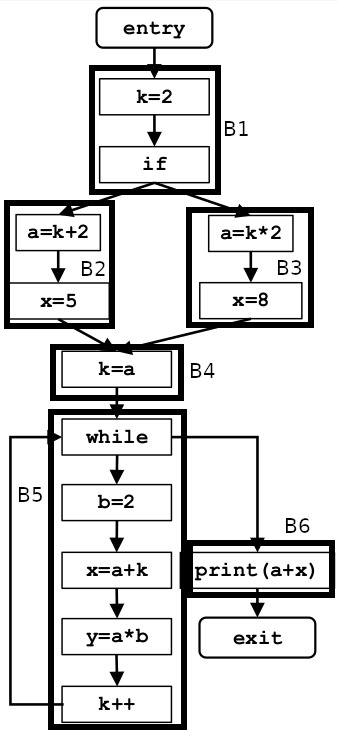

# Constant progation

 
<b>Framework</b>

Parameters | Value
--- | ---
Domain | all couples (var, const_val)
Direction | forward   $out[B] = F_B(in[B])$   $in[B] = ∧(out[p_B])$
Transfer function (F) | $F_B(in[B]) = Gen_B ∪ (in[B] - Kill_B)$
Meet operator ($∧$) | $∩$
Boundary condition | $out[entry] = ∅$
Initial interior points | $out[B] = U$

 

## Example

Domain = {a ,b, x, y, k}

Boundary condition and initialization
Flow point | Data representation
--- | ---
out[Entry] | ∅
in[B1] | -
out[B1] | U
in[B2] | -
out[B2] | U
in[B3] | -
out[B3] | U
in[B4] | -
out[B4] | U
in[B5] | -
out[B5] | U
in[B6] | -
out[B6] | U
in[Exit] | -

 

<b>Iteration 1</b>
Flow point | Data representation
--- | ---
out[Entry] | ∅
in[B1] | ∅
out[B1] | {(k,2)} ∪ (∅-{k}) = {(k,2)}
in[B2] | {(k,2)}
out[B2] | {(a,<u>k</u>+2),(x,5)} ∪ ({(<u>k,2</u>)} - {a,x}) = {(a,4),(x,5),(k,2)}
in[B3] | {(k,2)}
out[B3] | {(a,<u>k</u>*2),(x,8)} ∪ ({(<u>k,2</u>)} - {a,x}) = {(a,4),(x,8),(k,2)}
in[B4] | out[B2] ∩ out[B3] = {(a,4),(k,2)}
out[B4] | {(k,<u>a</u>)} ∪ ({(<u>a,4</u>),(k,2)} - {k}) = {(k,4),(a,4)}
in[B5] | {(k,4),(a,4)} ∩ U = {(k,4),(a,4)}
out[B5] | {(<u>b,2</u>),(x,<u>a</u>+<u>k</u>),(y,<u>a</u>*<u>b</u>),(k,<u>k</u>+1)} ∪ ({(<u>k,4</u>),(<u>a,4</u>)} - {b,k,x,y}) = {(b,2),(x,8),(y,8),(k,5)} ∪ {(a,4)} = {(a,4),(b,2),(x,8),(y,8)(k,5)}   the couple (k,4) is killed by the last instruction in the block, and the generation of the couples (x,8) and (k,5), which relies on the constant value of k, happens before that point
in[B6] | {(a,4),(b,2),(x,8),(y,8),(k,5)}
out[B6] | {(a,4),(b,2),(x,8),(y,8),(k,5)}
in[Exit] | {(a,4),(b,2),(x,8),(y,8),(k,5)}

changes have been registered

 

<b>Iteration 2</b>
Flow point | Data representation
--- | ---
out[Entry] | ∅
in[B1] | ∅
out[B1] | {(k,2)}
in[B2] | {(k,2)}
out[B2] | {(a,4),(x,5),(k,2)}
in[B3] | {(k,2)}
out[B3] | {(a,4),(x,8),(k,2)}
in[B4] | {(a,4),(k,2)}
out[B4] | {(k,4),(a,4)}
in[B5] | {(k,4),(a,4)} ∩ {(a,4),(b,2),(x,8),(y,8),(k,5)} = {(a,4)}
out[B5] | {(<u>b,2</u>),(y,<u>a</u>*<u>b</u>)} ∪ ({(<u>a,4</u>)} - {b,k,x,y}) = {(b,2),(y,8)} ∪ {(a,4)} = {(a,4),(b,2),(y,8)}
in[B6] | {(a,4),(b,2),(y,8)}
out[B6] | {(a,4),(b,2),(y,8)}
in[Exit] | {(a,4),(b,2),(y,8)}

 

<b>Iteration 3</b>
Flow point | Data representation
--- | ---
out[Entry] | ∅
in[B1] | ∅
out[B1] | {(k,2)}
in[B2] | {(k,2)}
out[B2] | {(a,4),(x,5),(k,2)}
in[B3] | {(k,2)}
out[B3] | {(a,4),(x,8),(k,2)}
in[B4] | {(a,4),(k,2)}
out[B4] | {(k,4),(a,4)}
in[B5] | {(k,4),(a,4)} ∩ {(a,4),(b,2),(y,8)} = {(a,4)}
out[B5] | {(a,4),(b,2),(y,8)}
in[B6] | {(a,4),(b,2),(y,8)}
out[B6] | {(a,4),(b,2),(y,8)}
in[Exit] | {(a,4),(b,2),(y,8)}
