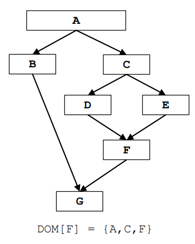

# Dominator Analysis

| Parameter               |                         Value                        |
|-------------------------|:----------------------------------------------------:|
| Domain                  |                  Set of Basic Blocks                 |
| Direction               | $Forward \\ OUT[B] = f(IN[B]) \\ IN[B] = ∧OUT[pred(B)]$ |
| Transfer function       |              $OUT[B] = f(IN[B]) = B ∪ IN[B]$         |
| Meet operation (∧)      |                   Intersection $(∩)$                   |
| Boundary condition      |                      $OUT[A] = A$                    |
| Initial interior points |              $OUT[B] = U$ (universal set)              |

## Example

<table class="tg">
<thead>
  <tr>
    <th class="tg-i81m"></th>
    <th class="tg-bclg" colspan="2">1st Iteration</th>
    <th class="tg-bclg" colspan="2">2nd Iteration</th>
  </tr>
</thead>
<tbody>
  <tr>
    <td class="tg-7fle"><b>Basic Block</b></td>
    <td class="tg-7fle"><b>IN[B]</b></td>
    <td class="tg-7fle"><b>OUT[B]</b></td>
    <td class="tg-7fle"><b>IN[B]</b></td>
    <td class="tg-7fle"><b>OUT[B]</b></td>
  </tr>
  <tr>
    <td class="tg-baqh">A</td>
    <td class="tg-baqh">{A}</td>
    <td class="tg-baqh">{A}</td>
    <td class="tg-baqh">{A}</td>
    <td class="tg-baqh">{A}</td>
  </tr>
  <tr>
    <td class="tg-baqh">B</td>
    <td class="tg-baqh">{A}</td>
    <td class="tg-baqh">{A,B}</td>
    <td class="tg-baqh">{A}</td>
    <td class="tg-baqh">{A,B}</td>
  </tr>
  <tr>
    <td class="tg-baqh">C</td>
    <td class="tg-baqh">{A}</td>
    <td class="tg-baqh">{A,C}</td>
    <td class="tg-baqh">{A}</td>
    <td class="tg-baqh">{A,C}</td>
  </tr>
  <tr>
    <td class="tg-baqh">D</td>
    <td class="tg-baqh">{A,C}</td>
    <td class="tg-baqh">{A,C,D}</td>
    <td class="tg-baqh">{A,C}</td>
    <td class="tg-baqh">{A,C,D}</td>

  </tr>
  <tr>
    <td class="tg-baqh">E</td>
    <td class="tg-baqh">{A,C}</td>
    <td class="tg-baqh">{A,C,E}</td>
    <td class="tg-baqh">{A,C}</td>
    <td class="tg-baqh">{A,C,E}</td>
  </tr>
  <tr>
    <td class="tg-baqh">F</td>
    <td class="tg-baqh">{A,C}</td>
    <td class="tg-baqh">{A,C,F}</td>
    <td class="tg-baqh">{A,C}</td>
    <td class="tg-baqh">{A,C,F}</td>
  </tr>
  <tr>
    <td class="tg-baqh">G</td>
    <td class="tg-baqh">{A}</td>
    <td class="tg-baqh">{A,G}</td>
    <td class="tg-baqh">{A}</td>
    <td class="tg-baqh">{A,G}</td>
  </tr>
</tbody>
</table>

Bit vector representation of the sets:

<table class="tg">
<thead>
  <tr>
    <th class="tg-i81m"></th>
    <th class="tg-bclg" colspan="2">1st Iteration</th>
    <th class="tg-bclg" colspan="2">2nd Iteration</th>
  </tr>
</thead>
<tbody>
  <tr>
    <td class="tg-7fle"><b>Basic Block</b></td>
    <td class="tg-7fle"><b>IN[B]</b></td>
    <td class="tg-7fle"><b>OUT[B]</b></td>
    <td class="tg-7fle"><b>IN[B]</b></td>
    <td class="tg-7fle"><b>OUT[B]</b></td>
  </tr>
  <tr>
    <td class="tg-baqh">A</td>
    <td class="tg-baqh">&lt;1000000&gt;</td>
    <td class="tg-baqh">&lt;1000000&gt;</td>
    <td class="tg-baqh">&lt;1000000&gt;</td>
    <td class="tg-baqh">&lt;1000000&gt;</td>
  </tr>
  <tr>
    <td class="tg-baqh">B</td>
    <td class="tg-baqh">&lt;1000000&gt;</td>
    <td class="tg-baqh">&lt;1100000&gt;</td>
    <td class="tg-baqh">&lt;1000000&gt;</td>
    <td class="tg-baqh">&lt;1100000&gt;</td>
  </tr>
  <tr>
    <td class="tg-baqh">C</td>
    <td class="tg-baqh">&lt;1000000&gt;</td>
    <td class="tg-baqh">&lt;1010000&gt;</td>
    <td class="tg-baqh">&lt;1000000&gt;</td>
    <td class="tg-baqh">&lt;1010000&gt;</td>
  </tr>
  <tr>
    <td class="tg-baqh">D</td>
    <td class="tg-baqh">&lt;1010000&gt;</td>
    <td class="tg-baqh">&lt;1011000&gt;</td>
    <td class="tg-baqh">&lt;1010000&gt;</td>
    <td class="tg-baqh">&lt;1011000&gt;</td>

  </tr>
  <tr>
    <td class="tg-baqh">E</td>
    <td class="tg-baqh">&lt;1010000&gt;</td>
    <td class="tg-baqh">&lt;1010100&gt;</td>
    <td class="tg-baqh">&lt;1010000&gt;</td>
    <td class="tg-baqh">&lt;1010100&gt;</td>
  </tr>
  <tr>
    <td class="tg-baqh">F</td>
    <td class="tg-baqh">&lt;1010000&gt;</td>
    <td class="tg-baqh">&lt;1010010&gt;</td>
    <td class="tg-baqh">&lt;1010000&gt;</td>
    <td class="tg-baqh">&lt;1010010&gt;</td>
  </tr>
  <tr>
    <td class="tg-baqh">G</td>
    <td class="tg-baqh">&lt;1000000&gt;</td>
    <td class="tg-baqh">&lt;1000001&gt;</td>
    <td class="tg-baqh">&lt;1000000&gt;</td>
    <td class="tg-baqh">&lt;1000001&gt;</td>
  </tr>
</tbody>
</table>
