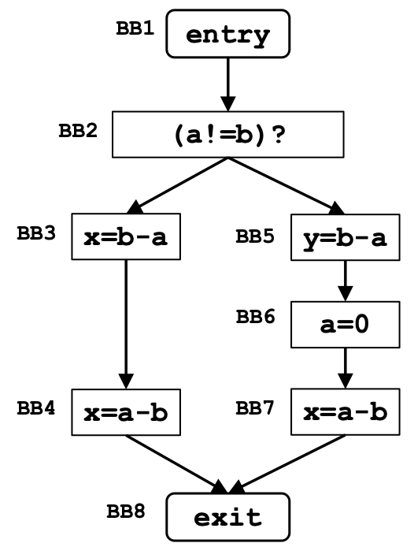

# Very busy expression

## Framework

| Algorithm parameters | Value |
| --- | --- |
| Domain | set of expressions |
| Direction |Backward:   $in[b] = f_b(out[b])$   $out[b] = \wedge in[succ(b)]$|
| Transfer function |$f_b(x) = Gen_b \cup (out_b – Kill_b)$   |
| Meet operation |$\cap$|
| Boundary Condition |$in[exit] = \emptyset$|
| Initial interior points |$in[b] = U$|

## Example

Domain: (a-b), (b-a)

||Gen|Kill|
|---|---|---|
|BB2|||
|BB3|b-a||
|BB4|a-b||
|BB5|b-a||
|BB6||a-b   b-a|
|BB7|a-b||
|BB8|||

|| Initialization|
|---|---|
||IN[B]|
|BB2|U|
|BB3|U|
|BB4|U|
|BB5|U|
|BB6|U|
|BB7|U|
|BB8|U|

|| Iteration 1||
|---|---|---|
||IN[B]|OUT[B]|
|BB2|Ø $\cup$ {(b-a) - Ø} = b-a| {(b-a),(a-b)} ∩ (b-a) = b-a|
|BB3|(b-a) $\cup$ {(a-b) - Ø} = {(b-a), (a-b)}|a-b|
|BB4|(a-b) $\cup$ {Ø - Ø} = a-b |Ø|
|BB5|(b-a) $\cup$ {Ø - Ø} = b-a|Ø|
|BB6| Ø $\cup$ {(a-b) - (a-b),(b-a)} = Ø |(a-b)|
|BB7|(a-b) $\cup$ {Ø - Ø} = a-b|Ø|
|BB8| Ø||

|| Iteration 2||
|---|---|---|
||IN[B]|OUT[B]|
|BB2|b-a|b-a|
|BB3|{b-a, a-b}|a-b|
|BB4|a-b |$\emptyset$|
|BB5|b-a|$\emptyset$|
|BB6|$\emptyset$ |a-b|
|BB7|a-b|$\emptyset$|
|BB8| $\emptyset$||
